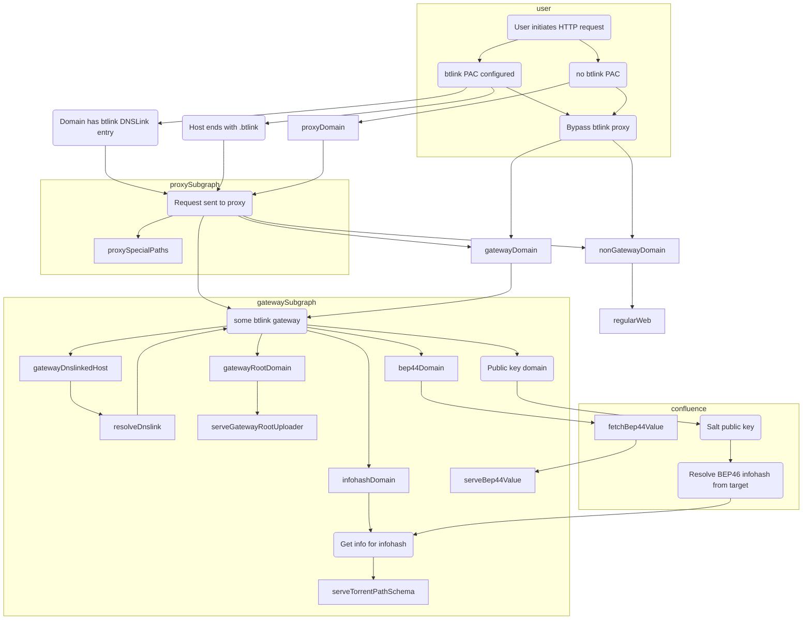
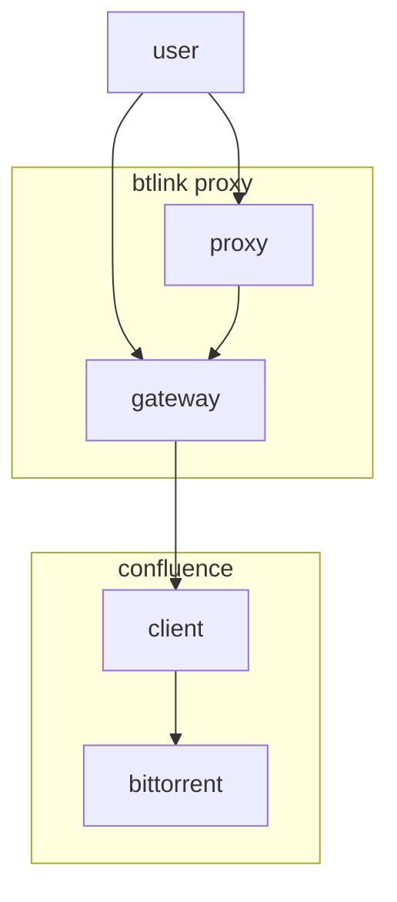

# btlink

btlink implements a HTTP(s) addressing scheme for BitTorrent.

## Naming

btlink is the working name, due to the combination of BitTorrent, HTTP URL "links" and the plan to implement something similar to [DNSLink](https://dnslink.io/). Alternative names might invoke something to do with swarms and webs, due to the overlap in terminology there in the use of BitTorrent and HTTP. Shelob, or the Flood for example. Less BitTorrent-specific names like distweb are an option if other backing data platforms are supported (like IPFS, or blockchains).

## Architecture

### Domain schema

#### Top-level domain

The top-level domain to trigger proxy intervention, and for general identification of btlink domain addressing (referred to as `tld`) was `.bt`. However that may be incompatible with the [ccTLD of Bhutan](https://en.wikipedia.org/wiki/.bt) (See issue [#2](https://github.com/anacrolix/btlink/issues/2)). The current `tld` in use is `btlink`.

Where possible, separate domains are used to reference different torrents to provide [origin isolation].

[origin isolation]: https://developer.mozilla.org/en-US/docs/Web/Security/Same-origin_policy

#### {infohash}-ih.{tld}/{[torrent path schema](#torrent-path-schema)}}

Files within a torrent are exposed via the URL path being the path components of the files join with `/`. Suitable headers may be included as determined. How is the info name field handled? Perhaps it is ignored, except for single-file torrents?
    
#### ({salt..}[.-])?{base36(public key)}-pk.{tld}/{[torrent path schema](#torrent-path-schema)}}

Serves torrent corresponding to lookup of mutable DHT item. Salt is optional per [BEP 46]. This means that owners of a public key can also manage cookies for their salted subdomains (and potentially other resources that support a subdomain relationship like this). The salt may or may not be part of the same label as the public key for wildcard certificate reasons.

#### {target}-44.{tld}
Fetches an immutable item from the DHT. `44` is a reference to [BEP 44]. The returned item is an encoded bencode value. Various path and query values might support conversion into other formats. Currently unimplemented.

[BEP 44]: http://bittorrent.org/beps/bep_0044.html
[BEP 46]: http://bittorrent.org/beps/bep_0046.html

### Path schema

#### Torrent path schema

Files within a torrent are exposed with a path equal to the components of the `path` list in the `info` `files` field joined with `/`. There may be additional special paths exposed within at `/.btlink/` and `/.well-known/` as found appropriate. Currently the info `name` is ignored, however for compatibility with webseeding, it may be exposed in a special directory for that purpose (possibly in `/.btlink/`).

#### Proxy btlink schema

Proxies can serve a dynamic PAC file from `/.btlink/proxy.pac`, and their CA certificate from `/.btlink/rootca.pem`.

## Link Records

Domains may link/alias into the `.{tld}` address scheme by use of a `_btlink` DNS record on the linked domain. For example `chromecast.link` might be hosted on btlink, by way of a `_btlink.chromecast.link` TXT record. The `_btlink` record contains a [magnet link] (or just the btlink domain) where the content will be found.

If a link record exists, it is possible to CNAME or ALIAS the parent domain to a btlink gateway to allow use by non-proxy-using clients.

### Magnet links

Per [BEP 46], `magnet:?xs=urn:btpk:[ Public Key (Hex) ]&s=[ Salt (Hex) ]`, corresponding to the `.pk.{tld}` domain space.

Regular BitTorrent magnet links correspond to the `.ih.{tld}` domain space.

## Infrastructure

Here proxies and gateways are described separately, but it's likely that in initial implementations they will be combined. There could be good reasons to separate them for more advanced use.

### Proxies

Proxies are used to transparently provide a mapping from URLs to BitTorrent without modifying HTTP client software. Support for configuring HTTP proxies is well-supported and common due to ubiquitous use on corporate and government systems, as well as by anti-censorship and privacy advocates.

Proxies route `.{tld}` and domains with `_btlink` records to a gateway. They may also expose [special paths](#proxy-btlink-schema) for configuration.

Proxies can set a header to tell origin servers that their clients support btlink. This means that dynamic sites can provide generic btlink URLs without explicitly selecting a public gateway as a fallback.

[PAC]: https://developer.mozilla.org/en-US/docs/Web/HTTP/Proxy_servers_and_tunneling/Proxy_Auto-Configuration_PAC_file

### Gateways

Gateways are HTTP servers that serve according to the [Addressing schema](#addressing-schema). They will also intercept requests to domains with `_btlink` records and serve those via BitTorrent if possible. Gateways can run behind reverse proxies and CDNs as they serve immutable, long-lived content.

## Browsers

### Chrome

Chrome must be restarted on Windows after installing root CA certificate.
You can manually re-apply proxy settings via <chrome://net-internals/#proxy>.

### Firefox

Firefox will reject certificates with wildcard domains with less than 2 fixed labels (https://bugzilla.mozilla.org/show_bug.cgi?id=1728009). It seems to require ownership information (subject O and OU fields?) on issuer and leaf certificate. It also appears to need restarting to load certificates from the system keychain. It will establish http2 connections to proxies if possible, which doesn't work.

### Safari

Safari will hang on proxy CONNECT attempts if they respond with `Transfer-Encoding: chunked` (https://feedbackassistant.apple.com/feedback/9578066, possibly not publicly viewable). Safari does not seem to support HTTPS proxies.

### curl

Does not appear to use the system keychain on MacOS. Passing `--proxy-cacert` and `--cacert` will let you specify a btlink CA file.

## TODO

 * Implement a secure channel to proxies for Safari.
 * See if Firefox supports name constraints on intermediate CAs.
 * Separate gateways and proxies.

## Open questions

 * Can we have a common root certificate shared by all gateways/proxies?
 * Does Safari support SOCKS? Via PAC?
 * Should the domain schema be collapsed so that a single wildcard certificate is sufficient?
